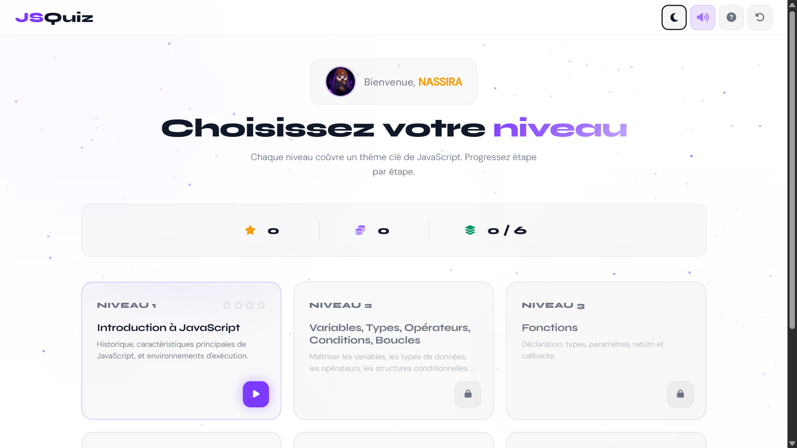

# JSQuiz
Quiz interactif pour évaluer et renforcer vos connaissances en JavaScript. Fondamentaux ou concepts avancés, chaque session vous rapproche de la maîtrise.


---

## 📋 Table des matières

- [Aperçu](#aperçu)
- [Fonctionnalités](#fonctionnalités)
- [Niveaux](#niveaux)
- [Types d'exercices](#types-dexercices)
- [Captures d'écran](#captures-décran)
- [Technologies](#technologies)
- [Installation](#installation)
- [Structure du projet](#structure-du-projet)
- [Utilisation](#utilisation)
- [Système de scoring](#système-de-scoring)
- [Auteur](#auteur)

---

## Aperçu

JSQuiz est une application web éducative conçue pour les étudiants de la filière Informatique et Intelligence Artificielle. Elle propose des exercices variés, organisés par niveaux de difficulté croissante, et couvre l'ensemble du programme de JavaScript.

## Fonctionnalités

- 🎬 Écran d'accueil animé avec champ d'étoiles (*starfield*)
- 🦉 Mascotte interactive (aide et réactions)
- 🌙 Thème sombre / clair avec transition fluide
- ⏱️ Minuterie activable / désactivable
- 🎵 Musique de fond et effets sonores
- ⭐ Système de scoring (étoiles, pièces, combo)
- 💾 Progression sauvegardée en `localStorage`
- 📱 Design adaptatif (mobile, tablette, bureau)
- 🔄 Réinitialisation complète

## Niveaux

| Niveau | Thème | Difficulté |
|--------|-------|------------|
| 1 | Introduction à JavaScript | Facile |
| 2 | Variables, Types, Opérateurs, Conditions, Boucles | Facile |
| 3 | Fonctions | Moyen |
| 4 | Objets & Tableaux | Moyen |
| 5 | DOM | Difficile |
| 6 | Événements, POO, jQuery & AJAX | Difficile |

## Types d'exercices

Chaque niveau contient **4 sessions**, une par type d'exercice :

| Type | Description | Minuterie |
|------|-------------|-----------|
| **Quiz** | Questions à choix multiples | 15 s |
| **Association** | Relier les concepts à leurs définitions | — |
| **Complétion** | Saisir le mot manquant dans le code | — |
| **Débogage** | Corriger le code erroné dans un éditeur | — |

## Captures d'écran



> D'autres captures seront ajoutées prochainement.

## Technologies

- **HTML5** — Sémantique et accessibilité
- **CSS3** — Variables CSS, Grid, Flexbox, animations, `backdrop-filter`
- **JavaScript ES6+** — Vanilla, sans framework
- **Font Awesome 6** — Icônes
- **Google Fonts** — Syne + DM Sans

## Installation

```bash
git clone https://github.com/NassiraHamiCh/JsQuiz.git
cd jsquiz
```

Ouvrir `index.html` dans votre navigateur.

> Aucun serveur requis — le projet fonctionne en ouvrant directement le fichier HTML.

## Structure du projet

```
jsquiz/
├── index.html              # Page d'accueil (présentation du projet)
├── game.html               # Application quiz (splash + pseudo + jeu)
├── css/
│   └── style.css           # Tous les styles (tokens, composants, responsive)
├── js/
│   ├── questions.js        # Banque de questions (6 niveaux × 4 sessions)
│   ├── script.js           # Logique du jeu (navigation, exercices, scoring)
│   └── landing.js          # Scripts de la page d'accueil (starfield, animations)
├── assets/
│   ├── images/             # Hibou, mascotte, profil, UI
│   └── sounds/             # Musique et effets sonores
└── README.md
```

## Utilisation

1. Ouvrir `index.html` → lire la présentation du projet
2. Cliquer **« Lancer le quiz »** → saisir votre pseudo
3. Choisir un niveau → lire l'introduction
4. Cliquer **« Commencer le niveau »**
5. Compléter les 4 sessions (quiz → association → complétion → débogage)
6. Terminer le niveau → débloquer le suivant

## Système de scoring

| Action | Points |
|--------|--------|
| Bonne réponse | +20 ⭐ |
| Combo x3+ | +streak × 2 ⭐ |
| Session parfaite (100 %) | +30 ⭐ bonus |
| Passer une question | −5 ⭐ |
| Aide du hibou | −5 ⭐ |

- **3 étoiles** par session → niveau validé
- **4 sessions validées** (1 étoile minimum) → niveau terminé

## Auteur

**Nassira Hamich**  
Filière Informatique et Intelligence Artificielle — FPN

Encadré par : **Pr. Farida BOUROUMANE**  
Module : Programmation Web 2 — JavaScript  
Année universitaire : 2025 / 2026

---

## Licence

Ce projet est réalisé dans un cadre académique.
